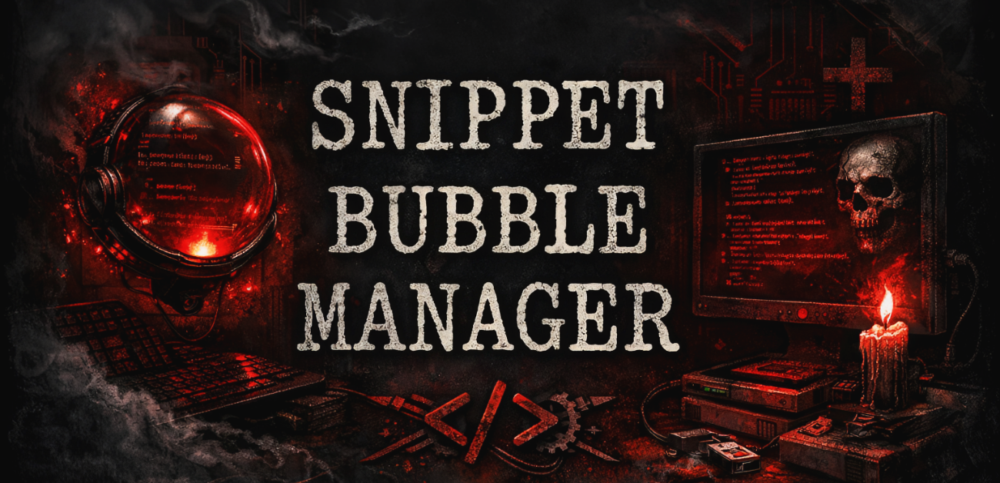
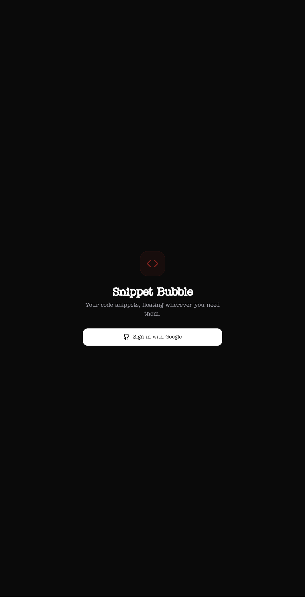
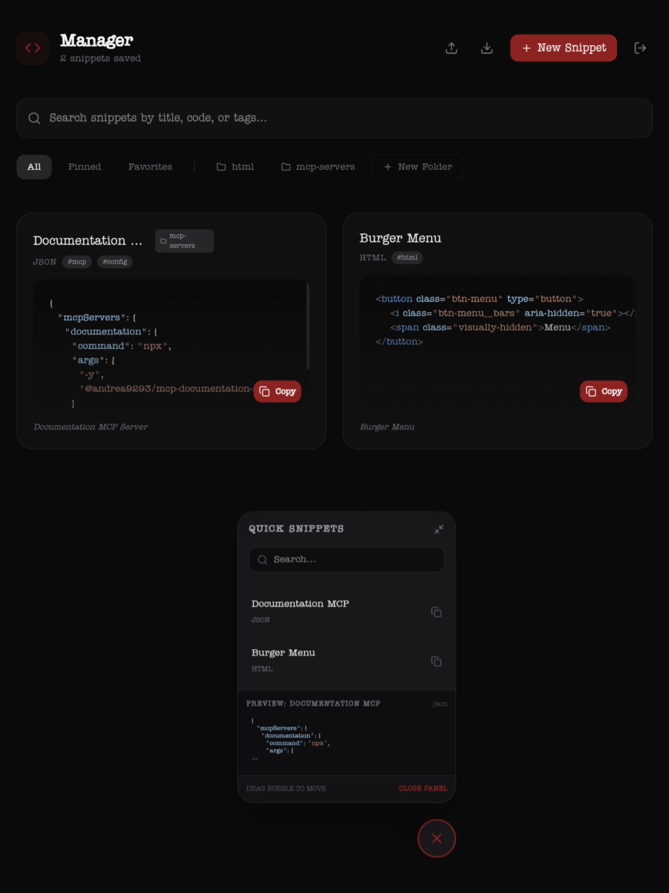
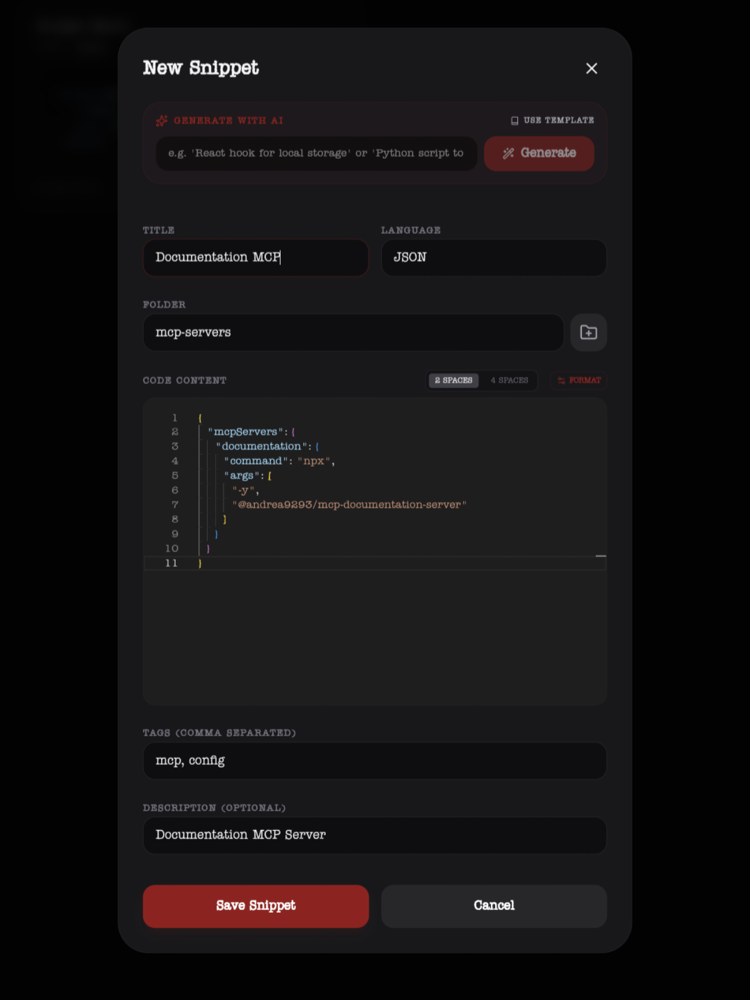

<div align="center">

# 🫧 Snippet Bubble Manager

### ⚡ Your code. One click away. Always within reach.

<br/>

<!-- BADGES -->


<br/>

<!-- OPTIONAL BANNER -->


</div>

---

## 💀 What This Is

Snippet Bubble Manager is a **floating, always-on-top snippet tool** that lives in your workflow like a silent little assassin.

It doesn’t ask permission.  
It doesn’t get in your way.  
It just sits there—ready to drop code into your clipboard faster than your brain can say *“where the hell did I put that?”*

---

## 🎯 Why You Built This (aka The Problem)

- You copy the same snippets 1000 times
- You forget where you saved half your useful code
- Your “organization system” is vibes and chaos
- Clipboard history apps aren’t built for developers

So yeah—this fixes that.

---

## 🔥 Features That Actually Matter

### 🫧 Floating Bubble UI
- Always on top
- Expand / collapse instantly
- Minimal footprint, maximum damage

### ⚡ One-Click Copy
- Copy snippets instantly
- Track last copied
- Zero friction

### 🧠 Smart Snippet Storage
- Titles, descriptions, tags
- Language-aware organization
- Favorites & pinned snippets

### 📁 Folder Organization
- Keep your chaos contained
- Group by project, language, or whatever your brain needs

### ☁️ Firebase-Powered Backend
- Real-time updates
- Auth-secured ownership
- Sync-ready foundation

---

## 🖼 UI Preview

<p align="center">
  
  
  
</p>

---

## 🧱 Tech Stack

| Layer        | Tech                          |
|-------------|-------------------------------|
| Frontend     | React + TypeScript + Vite     |
| Styling      | CSS                           |
| Backend      | Firebase (Firestore)          |
| Auth         | Firebase Authentication       |

---

## 📂 Project Structure

```
snippet-bubble-manager/
├── src/
│   ├── App.tsx
│   ├── firebase.ts
│   ├── types.ts
│   ├── main.tsx
│   └── index.css
│
├── firestore.rules
├── index.html
├── package.json
├── vite.config.ts
├── .env.example
└── docs/
    ├── banner.png
    └── screenshots/
```

---

## 🚀 Getting Started

### 1. Clone

```bash
git clone https://github.com/YOUR_USERNAME/snippet-bubble-manager.git
cd snippet-bubble-manager
```

---

### 2. Install

```bash
npm install
```

---

### 3. Environment Setup

Create `.env.local`:

```env
VITE_FIREBASE_API_KEY=your_key_here
VITE_FIREBASE_AUTH_DOMAIN=your_project.firebaseapp.com
VITE_FIREBASE_PROJECT_ID=your_project_id
VITE_FIREBASE_STORAGE_BUCKET=your_project.appspot.com
VITE_FIREBASE_MESSAGING_SENDER_ID=xxxx
VITE_FIREBASE_APP_ID=xxxx
```

---

### 4. Run

```bash
npm run dev
```

Open → `http://localhost:5173`

---

## 🔐 Firestore Rules (Don’t Screw This Up)

- Users only access their own snippets
- `ownerId === auth.uid`
- No public free-for-all data chaos

---

## 🧠 Data Model

```ts
{
  title: string
  code: string
  language?: string
  description?: string
  tags?: string[]
  isFavorite?: boolean
  isPinned?: boolean
  ownerId: string
  lastCopiedAt?: string
  createdAt: string
  updatedAt: string
  folderId?: string
}
```

---

## 🧨 Roadmap (Where This Gets Dangerous)

- 🧲 Global hotkeys (summon the bubble instantly)
- 🖥 Desktop app (Electron or Tauri)
- 🔍 Fuzzy search that doesn’t suck
- 🧠 AI snippet suggestions
- ☁️ Multi-device sync dashboard
- 🎯 Context-aware snippets (language detection, auto-suggest)

---

## ⚠️ Known Limitations

- No offline mode (yet)
- UI still evolving
- Firebase required (don’t argue with reality)

---

## 🧪 Dev Notes

- Built fast, iterated faster
- Designed to stay lightweight
- Structured for future expansion into a full dev tool ecosystem

---

## 🖤 Philosophy

You didn’t build this to be cute.

You built this because:
- Time matters
- Repetition is stupid
- And your brain has better things to do than remember where a snippet lives

---

## 📜 License

MIT — do whatever you want, just don’t be an idiot about it.

---

## 🧠 Final Thought

Stop digging.  
Stop rewriting.  
Stop wasting time.

Let the bubble handle it.